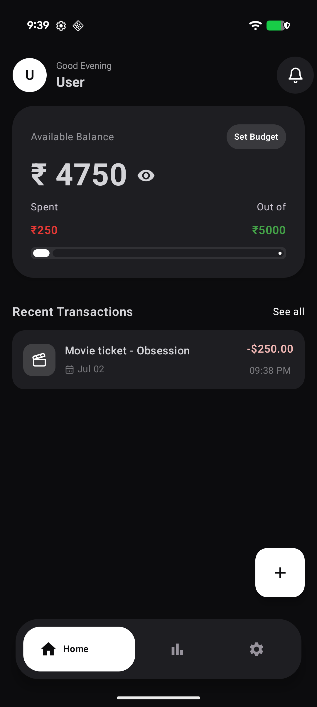
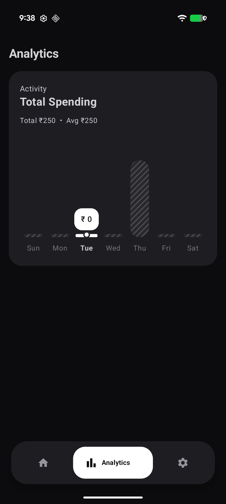
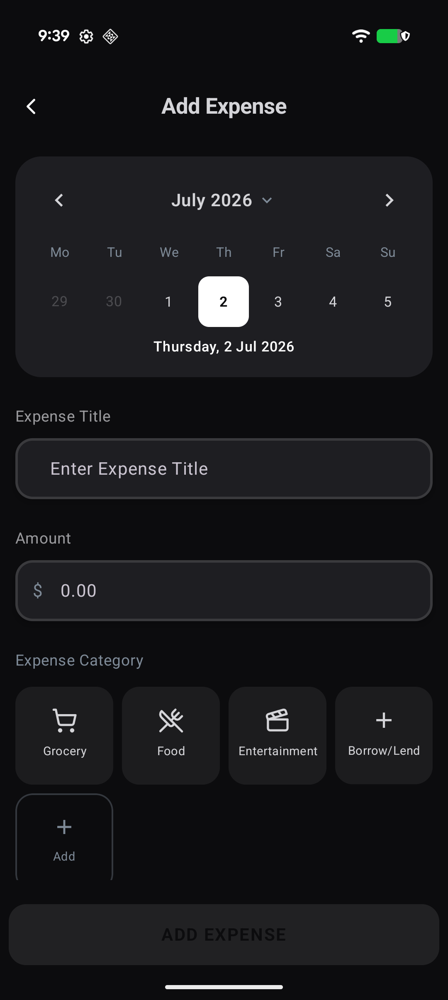
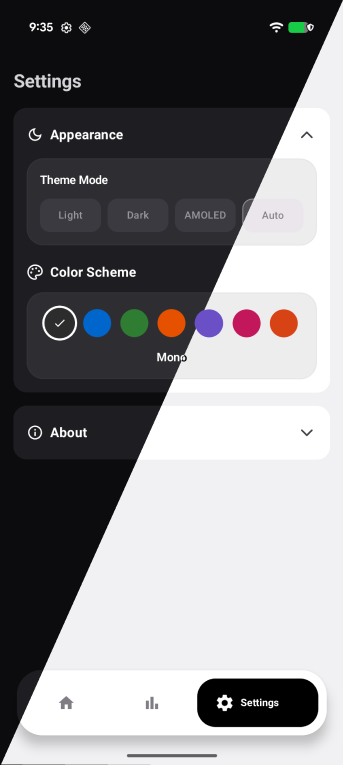

# Wise Spend

Wise Spend is an Android app for tracking daily expenses and managing personal budgets.

## Features

- Record daily expenses with categories, notes, and dates.
- Organize expenses into categories like Food, Shopping, Travel, Health, and custom user-defined ones.
- Light, dark, and AMOLED themes with color schemes
- All data stored locally via Room database, nothing leaves the device.

<details>
<summary><b> Screenshots </b> </summary>

<div align="start">
  
  
</div>
<div align="start">
  
  
</div>
</details>

## Getting Started

### Prerequisites

- Android Studio Koala or newer
- JDK 17
- Android SDK 24 or higher

### Installation

1. Clone the repository:
   ```bash
   git clone https://github.com/barebones/WiseSpend.git
   ```
2. Open the project in Android Studio.
3. Sync the project with Gradle files.
4. Run the application on an emulator or a physical device.

## Project Structure

```
app/
├── data/
│   ├── local/          # Room entities, DAOs, database
│   ├── model/           # Data models
│   └── repository/      # Repository layer
├── navigation/          # Nav graph and routes
├── ui/
│   ├── components/      # Reusable composables
│   ├── screens/          # Screen-level composables
│   └── theme/            # Colors, typography, theming
├── util/                 # Helper/utility functions
├── viewmodel/            # ViewModels
└── MainActivity.kt
```


## Planned Features

- [ ] Savings goals
- [ ] View spending Day/Week/Month/Year ranges.
- [ ] Home screen widgets
- [ ] Expense search and filters
- [ ] Multiple currencies
- [ ] Data export/import
- [ ] Monthly spending insights
- [ ] Expense reminders
- [ ] Attach receipts/images to expenses


## License

This project is licensed under the GPL-2.0 license — see the [LICENSE](LICENSE) file for details.
